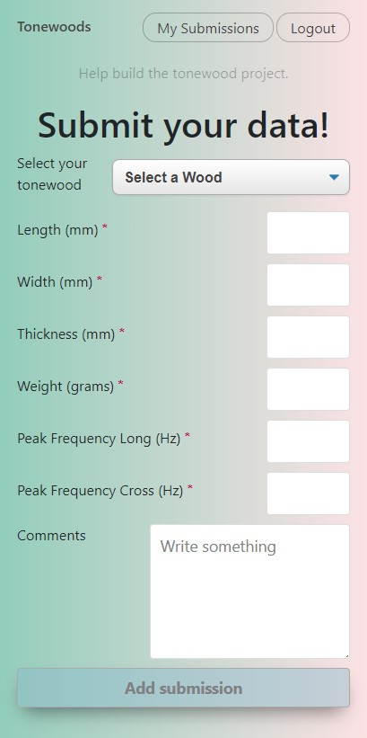

Tonewood Data Project - Testing Version

## Live Link
<https://test-tonewood-app.kevinrobinsondeveloper.now.sh>

## Summary

An app designed for luthiers to centralize data about wood samples intended for building musical instruments. One of the primary values in presenting the data in this manner is to compare measured properties of different samples in a clear manner.  The app functions as a personal catalogue of one's submissions and a data collecting tool.

For each sample, given a series of measurements some calculations are made that will aid a luthier.

## API used

<https://github.com/hotdogmcgee/test-tonewoods-api>

## Screenshots

Welcome Page 

Submit Data

## How to use the app

To use full functionality of app you must login or register. This version of the app has a test user name available for use. Click on the button with text "Show credentials to test Login" to do so.

If you are curious how luthiers gather their data, click on "Download PDF Instructions." N.B. That document needs some updates

## Technology Used

React, Node.js, Heroku, Now/Zeit, Postgresql, HTML, CSS
